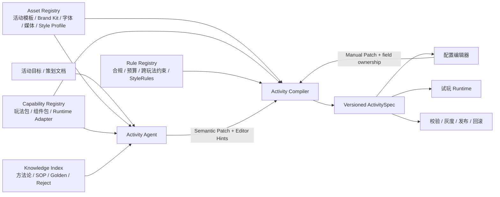

# 抖音 AI 工作台产品架构基线

> 状态：Accepted for P0（2026-08-06 增补活动模板、交付物与分层素材架构；已完成 Codex 主审与 Claude Fable 5 / Opus 5 反方复核）
> 作用：这是后续玩法、资产与 Agent 生成能力的共同评审基线。若实现与本文冲突，应先修改架构决策，再修改页面。
> 关联说明：[玩法拆解与配置说明](./gameplay-configuration.md)

## 1. 产品定论

抖音 AI 工作台不是“让模型临时生成一张配置表”，而是一个**资产驱动的活动产品编译器**：Agent 读取活动目标与平台沉淀，在受约束的活动模板、玩法能力和品牌资产中完成选型、组装与参数建议，产出可试玩、可编辑、可校验、可发布的活动版本。

资产中心是平台最重要的供给入口，但不是产品的唯一核心；真正的核心是“意图 → 选型 → 编译 → 可校验交付物”的闭环。玩法是活动的**行为内核**，决定用户如何参与和运行时如何记账，但不是活动模板的唯一身份。真实活动还由内容组织、活动阶段、激励结算和交付矩阵共同定义；无玩法活动和多玩法并列活动都必须能被自然表达。

三个原则不可退让：

1. `ActivitySpec` 是一场活动唯一的**配置与产品意图事实**，聊天、配置台、预览、发布都由同一份 Spec 派生；任务完成、账户余额、库存扣减等运行期事实仍归对应业务系统所有。
2. Agent 只能提交有语义的 Patch，不能直接生成 React、任意表单 Schema 或线上配置；玩法包与编译器共同决定“能生成什么、怎么编辑、如何校验”。
3. 资产、能力、知识和规则在底层分治：资产与玩法能力在“资产中心”聚合，知识维持在“资源库”，规则仅由平台管理员维护；运营不接触服务 ID、SDK 接线和历史平台包袱。

## 2. 整体结构



这不是一条只在创建时运行一次的流水线。生成、人工编辑、再次让 Agent 优化都经过同一个编译闭环，任何入口都不能绕过 Spec、版本和校验。

## 3. 四类平台沉淀

| 层 | 真实职责 | 典型对象 | 不负责 |
| --- | --- | --- | --- |
| Asset Registry | 可直接消费或复用的活动配方、品牌与媒体资产、授权和版本 | ActivityTemplate、Brand Kit、Logo、字体、图片、Style Profile、参考集 | 玩法运行逻辑 |
| Capability Registry | 可执行、可编辑的产品能力 | GameplayPackage、ComponentPackage、Runtime Adapter | 品牌资产本体 |
| Knowledge Index | 给 Agent 检索和解释的经验 | Markdown、SOP、案例、Golden/Reject、复盘 | 硬校验和线上阻断 |
| Rule Registry | 可执行的确定性约束 | 概率、库存、预算、合规、跨玩法引用、发布门禁 | 生成创意和解释业务 |

“玩法库”在产品上属于资产中心的一种浏览视图，在工程上属于 Capability Registry，不能因为 UI 聚合就混入 Asset Registry。

### 3.1 玩法分两层，但不建第二个事实源

业务语义上，玩法必须区分为两层：

1. **活动主流程内核**：解释用户如何触达、理解活动、分流、参与、回流与结算，决定这场活动“怎么跑”。它是 `ActivityTemplate.coreFlow` 的可复用声明，引用到项目后由 `ActivitySpec.coreFlow` 锁定版本并承载显式覆写。
2. **玩法组件**：榜单、助力、抽奖、集卡、投票、小游戏等可执行能力，由 `GameplayPackage` 声明 Schema、编辑器、运行时和校验器，在项目中按槽位实例化。

平台不再建立独立的 `GameplayComposition` / `CoreGameplay` 注册层。值得复用的主流程沉淀为活动模板的结构化字段；项目内的具体流程与组件挂载关系都由 `ActivitySpec` 统一记录。“项目文档”可以展示和解释主流程，但 Markdown 不是运行事实源。

最小对象边界如下：

| 对象 | 唯一职责 | 不包含 |
| --- | --- | --- |
| `ActivityTemplate` | 声明活动主流程、阶段、内容结构、交付物要求和 0～N 个玩法组件槽位 | 具体品牌值、项目文案、运行时状态 |
| `DeliverySurface` | 声明 Lynx、H5、原生页或资源位的端能力、设计画板、实际交付尺寸、安全区和审核要求 | 活动内容和视觉风格 |
| `GameplayPackage` | 声明一个玩法的 Schema、编辑器、运行时、校验器和埋点契约 | 活动页面、品牌与资源位 |
| `BrandKit` | 声明品牌身份、Logo、字体角色、色彩和硬规则 | 节日主题和项目专属 KV |
| `StyleProfile` / `IP Kit` | 叠加节日主题、构图语言和角色资产 | 主品牌所有权 |
| `IncentiveScheme` | 声明奖励类型、预算/库存、发放方式、资质、法务与风控占位 | 单一玩法的交互规则 |
| `ActivitySpec` | 锁定本项目采用的版本并保存业务意图、内容值和覆写 | 编译后的页面文件 |
| `ActivityDeliverable` | 一个需要验收、校验和发布的具体页面或物料实例 | 输入素材和探索稿 |
| `ProjectMaterial` | 项目输入、生成素材、方向稿和外部参考 | 发布完成度和运行逻辑 |
| `CompileRun` | 只追加地记录一次编译的输入版本、Patch、结果和差异 | 可编辑业务意图 |

`ActivityTemplate` 必须保持为薄装配声明，字段以引用为主：

```ts
type ActivityTemplate = {
  id: string
  version: string
  scenarioTags: string[]
  coreFlow: {
    objective: string
    entryPoints: string[]
    steps: Array<{
      id: string
      role: 'reach' | 'understand' | 'branch' | 'participate' | 'return' | 'settle'
      next: string[]
      gameplaySlotRefs?: string[]
    }>
    completion: string
  }
  phases: Array<{ id: string; role: 'preheat' | 'live' | 'settlement' }>
  contentSchemaRef: VersionRef
  gameplaySlots: Array<{
    id: string
    required: boolean
    accepts: GameplayPackageRef[]
  }>
  deliverables: Array<{
    id: string
    role: string
    surfaceRef: DeliverySurfaceRef
    quantity: number | { fromContentField: string }
    states?: string[]
    phaseRef: string
  }>
  brandSlots: Array<{ role: string; required: boolean }>
  incentiveSlot?: { required: boolean; accepts: string[] }
  ruleSetRefs: VersionRef[]
}
```

“状态变体”必须是一等字段。五种榜单状态仍可能是一个页面交付物的五个状态，不能自动算作五个页面。`DeliverySurface` 同时保存设计画板尺寸和真实交付尺寸；两者不一致时不得用画板名覆盖交付合同。

### 3.2 Style Bible 的拆分

Style Bible 不是一份万能 Markdown，而是四件相互引用的对象：

- `StyleProfile`：颜色、排版、构图密度、圆角、动效等结构化偏好。
- `ReferenceSet`：Golden / Reject 视觉样本及其标签。
- `StyleRules`：可执行的强约束，例如 Logo 安全区、字体禁用和品牌色容差；资产侧保存来源与版本，发布时注册为 Rule Registry 可执行规则并由 Compiler 消费。
- `StyleGuide`：供人和 Agent 理解的说明文档。

### 3.3 可生产资产的统一契约

资产中心管理的不是“图片文件列表”，而是可被 Agent 检索、编译器校验和具体项目引用的版本化资产包。无论是 Brand Kit、心仔角色、Banner 模板、直播间分层套件还是字体，至少包含六部分：

| 契约 | 内容 |
| --- | --- |
| Manifest | 类型、版本、负责人、状态、适用端和引用范围 |
| Content Set | 角色动作、模板、图层、字体文件、Golden/Reject 等真实内容 |
| Parameter Schema | 可配置值、Agent 推断值、引用资产和不可变规则；不同资产类型拥有不同字段 |
| Delivery Spec | 必需/可选交付物、尺寸、格式、透明度、图层顺序和运行端适配 |
| Governance | 来源证据、授权范围、导入格式、版本记录和发布门槛 |
| Bindings | 资产版本绑定到具体项目对象/槽位的记录，以及人工接管状态 |

具体资产不能被压成同一种参数表。例如心仔角色包管理比例、结构件、动作、表情和道具；Banner 管理标题容量、版式、场景、Logo 槽位和交付尺寸；直播间套件管理 1536×2752 画布、中央 74% 安全区、F/H/J/L/N 等分层及权益文案；字体管理字重、排版角色、字符集、端能力和授权。共用的是版本、引用、导入和校验机制，不是业务字段。

资产产品界面固定分为三种状态：目录用于检索和选择，完整详情页用于读懂某个不可变版本的内容、参数、来源、引用与质量门槛，版本表单用于新建资产、创建变体或从已发布版本派生草稿。类型只在首次创建时选择；版本和变体不得改变类型。导入文件、参数、交付物、授权与质检记录随草稿一起保存，发布后整体冻结。

### 3.4 分层图片与分层模板

分层不是第二套图片产品。每个图片版本都由一张必备的扁平交付图和一份编辑源 `LayerManifest` 构成；普通单图只是 manifest 中只有一个铺满画布的 raster 根图层。因此产品不增加“单图 / 可分层 / 已分层”互斥状态和筛选；“可分层”只是 Agent 分析后的临时建议。

```ts
type ImageAssetVersion = {
  version: number
  flatUrl: string
  flatHash: string
  manifestHash: string
  rendererVersion: string
  source: 'generated' | 'uploaded' | 'imported' | 'derived'
  manifest: {
    canvas: { width: number; height: number }
    templateRef?: { id: string; version: string }
    styleBibleRef?: { id: string; version: string }
    layers: Array<{
      id: string
      type: 'raster' | 'text' | 'vector' | 'upload'
      renderer: 'image-model' | 'raster-art' | 'true-text' | 'brand-asset' | 'source-asset'
      x: number; y: number; width: number; height: number; z: number
      visible: boolean; locked: boolean
    }>
  }
}
```

`LayerTemplate` 是资产中心的独立对象类型，与 `StyleProfile` 共用“风格与模板”的浏览区，但拥有独立类型、版本史和引用关系。它只定义画布、语义槽位、槽位类型、安全区、层序、可变/锁定范围及可选的 `styleBibleRef`，不把模型路由和质检整体塞成一个泛化 Recipe：

- 模型路由是内部执行策略，根据图层语义选择图像模型、真文字、艺术字栅格或品牌资产渲染器，不暴露为运营资产。
- 分层质检由槽位约束、StyleRules 和扁平图/manifest 一致性校验派生，P0 不另建独立“质检资产”。
- 项目必须锁定模板的精确版本，不自动跟随 latest；新模板只生成可解释的迁移差异，由运营显式采用。
- 图层修改总是新建素材版本，在一次事务中生成新扁平图、manifest 和校验记录；任一步失败都不覆盖当前版本。

项目素材库是分层实例的日常工作面：素材详情页沿用唯一入口进入三栏编辑器（左侧图层、中间固定画布、右侧按 renderer 切换的属性）。对单图可先分析高置信的真文字、Logo、价格和 CTA，运营预览建议后再采用；艺术字和精细插画默认保留在栅格层。P0 仅编辑内容、显隐、不透明度与可变层序，不允许自由拖拽、缩放和旋转破坏模板安全区。

资产中心 P0 负责浏览、版本化和引用 `LayerTemplate`，不提供从空白画布搭模板的通用编辑器。成熟项目素材后续可通过“提升为模板”经审核进入资产中心，避免产生脱离实际生产的第二套模板库。

## 4. 核心契约

### 4.1 ActivitySpec

`ActivitySpec` 至少包含：

- 活动元信息、参与范围和版本；
- 锁定的活动模板版本、主 Brand Kit，以及按角色叠加的 Style Profile / IP Kit 版本；
- 从模板解析后的结构化 `coreFlow`，包括入口、节点顺序、分支、组件挂载点、回流点和完成条件；
- 活动阶段、内容字段、交付数量计算值和显式覆写；
- 0～N 个已启用的玩法实例、槽位归属及其参数；
- 激励方案引用；P0 尚未接通发放时也必须显式标记“无激励 / 待确认”，不能默认为空；
- 内容对象、奖品、任务和跨对象引用；
- 资产绑定及版本；
- 生成来源、手动接管字段和变更历史；
- 目标运行端与 Adapter 版本。

编辑器状态不是第二份业务数据。折叠、筛选、当前选中对象等纯 UI 状态可本地保存，但任何影响运行结果的字段必须回写 Spec。

项目可以选择一个主 Brand Kit，并按角色叠加节日 Style Profile、IP Kit 或合作品牌锁定件。若后续确有多主品牌需求，`brandBindings` 可以保存多个带角色和优先级的引用；P0 不提供无约束的多 Brand Kit 混合，也不在模板中预枚举品牌兼容矩阵。编译器根据模板要求的品牌槽位和所选资产实际提供的槽位做兼容校验。

### 4.2 GameplayPackage

每个玩法包是一个可版本化产品单元，必须同时提供：

| 契约 | 内容 |
| --- | --- |
| Manifest | 名称、版本、兼容端、生命周期、负责人 |
| Config Schema | 业务字段、默认值、枚举和迁移规则 |
| Ports | 输入资源、输出资源、可引用内容和跨玩法关系 |
| Editor Recipe | 运营决策顺序、字段控件、摘要和专属对象编辑槽位 |
| Runtime Adapter Contract | Spec 如何被抖音/H5/Lynx 等运行端消费 |
| Validators | 玩法内部规则与可定位的错误 |
| Test Cases | 默认样例、边界样例、迁移和兼容性样例 |

玩法页不共用一张总流程，也不强迫所有玩法套同一布局。编译器只复用控件、Patch、版本和校验机制；每个 GameplayPackage 自己声明适合该玩法的运营决策顺序。

### 4.3 Semantic Patch

所有业务修改统一表达为：

```ts
type ActivityPatch = {
  op: 'replace' | 'add' | 'remove'
  path: KnownBusinessPath
  value?: unknown
  actor: 'agent' | 'operator' | 'import'
  reason?: string
  baseRevision: number
}
```

- `KnownBusinessPath` 由玩法包和平台 Schema 共同声明，不接受任意路径。
- 运营修改过的字段默认变成 `operator-owned`；后续 Agent 只能提出建议，不能静默覆盖。
- 导入、模板派生和继承更新同样编译为 Patch 批次；命中人工接管字段时默认进入差异确认，禁止静默覆盖。
- 对包含人工接管后代字段的祖先对象执行 `replace/remove`，视同触碰人工字段；默认按单条 Patch 跳过，不连带取消同批次中其他安全修改。
- 运营可显式执行“恢复自动优化”解除字段接管，解除动作本身记入变更历史，不能由 Agent 代为执行。
- Patch 应先在草稿副本上应用并校验，通过后再产生新 revision。

### 4.4 EditorSpec

EditorSpec 是编译产物，不是 Agent 产物。它只描述本次活动当前可编辑的控件、摘要、对象槽位、禁用原因和定位后的校验结果；最终 React 组件仍由平台维护。

Agent 可返回受白名单约束的 `EditorHints`（推荐展开的组、建议排序、解释文案），编译器可以接受或丢弃，不能让 Hints 改变字段权限和业务语义。

## 5. Agent 生成闭环

1. 解析目标，产出结构化 Activity Brief，不把原文段落直接变成页面。
2. 从 Capability Registry 选择玩法包版本，从资产中心解析符合品牌、授权和运行端条件的资产。
3. 检索知识层得到运营经验与反例；硬约束始终交给 Rule Registry。
4. 生成 Semantic Patch，在草稿 Spec 上执行。
5. Compiler 完成 Schema、玩法内、跨玩法、预算/库存与运行端兼容校验。
6. 编译 EditorSpec 与 RuntimeSpec，配置台和试玩同步更新。RuntimeSpec 是 ActivitySpec 当前 revision 的只读派生物，不可反向写入。
7. 人工修改产生新的 operator Patch；再次生成时保护人工接管字段。
8. 发布生成不可变版本，只移动环境指针；回滚不修改历史版本。

## 6. 产品信息架构

### 6.1 全局层

- **项目库**：活动项目和版本入口。
- **资产中心**：活动模板、Brand Kit、玩法库、视觉能力、字体库。活动模板详情展示主流程内核、阶段、内容结构、玩法组件槽位和交付矩阵；Brand Kit 区管理品牌身份及其可用的 IP/模板资产；玩法库仍由 Capability Registry 提供；视觉能力区浏览 StyleProfile 与 LayerTemplate；字体库保持独立授权与端能力。目录是跨项目沉淀的管理与选择入口，不是把所有对象写进同一张参数表。
- **资源库**：工具、知识、模型、发布器、触发器等 Agent 能力资源，维持现有语义。
- **技能库**：可被 Agent 调用的技能。

Rule Registry 不提供普通运营入口，由平台管理员在能力治理面维护；活动项目只接收定位到具体配置项的校验结果。

### 6.2 项目层

项目层固定为四个运营入口，它们共享一份 `ActivitySpec`，不是四套事实源：

1. **活动资产**：实际需要验收和发布的 `ActivityDeliverable`。二级节点直接列具体交付件，例如“Lynx · 主会场”“H5 · 游戏分会场”“话题 Banner · 1029×195”“活动战报 · 1080×26668”；节点显示端类型、真实交付规格、状态数、阶段和完成状态。探索稿和参考图禁止混入。
2. **项目文档**：包含一个由 `ActivitySpec.coreFlow` 渲染的“活动主流程内核”结构化视图，让运营先看懂入口、分流、参与、回流和结算；同时容纳活动背景、脑暴、概念交集、评审结论和策划说明。Markdown 可影响 Agent 建议，但不直接成为运行配置。
3. **玩法配置**：只处理本项目的 `GameplayPackage` 实例、参数与共享业务对象，不重复编辑活动主流程。玩法按实例一级切换，每种玩法保留自己的运营决策顺序；参数修改写回 ActivitySpec 并只重编译受影响交付物。
4. **素材库**：`ProjectMaterial` 的日常工作面，管理图片、视频、字体、分层源、探索方向和外部参考。素材可以被交付物引用，但自身不计入交付完成度；外部参考必须标记为不可编译引用。

模板、主 Brand Kit、叠加 Style/IP、阶段和激励的摘要固定展示在项目首屏/活动资产总览，不再暴露“数据库”作为一级运营导航。“数据库”和“项目文件”保留在开发者高级入口，避免把技术实现伪装成业务对象。

“玩法配置”遵循以下界面规则：

- 一级切换独立玩法实例；每种玩法有自己的信息顺序。
- 首屏先说明“当前生成了什么”和关键生效值。
- 紧接真实对象与可改参数；一级面板默认展开，高级参数才按需收起。
- 展示本次生成引用的玩法包、Brand Kit、Style Profile、字体和知识来源，并允许跳转到全局资产中心。
- 资产绑定落在具体对象和槽位，不另做一张与玩法脱节的“素材清单说明页”。
- 校验在保存/发布时就地定位，不常驻一张开发检查大盘。

活动模板与项目交付物必须明确区分：前者是平台可复用配方，后者是某个项目某个版本的编译结果。界面可以沿用用户熟悉的“活动资产”名称，但领域类型统一使用 `ActivityDeliverable`，不得叫 `ActivityAssetInstance`，避免与图片素材资产混淆。

### 6.3 真实样例：2026 抖音 ACG 新春会

该 Figma 交付证明这不是“集卡活动模板”，而是“IP 联名 · 双会场 · 节点大会场”模板的一个项目实例。活动的稳定结构是双会场内容组织、榜单/助力行为和预热—主推—结算传播阶段；集卡、跃马攀峰等玩法组件可替换或并列。

模板实例应包含：

- 阶段：预热、主会场开启、分会场主推、结算战报；
- 内容结构：活动主题、游戏/二次元会场、嘉宾主理人、分类与榜单口径、规则和阶段文案；
- 主流程内核：资源位触达 → 主会场理解 → 游戏/二次元双会场分流 → 榜单参与 → 组件回流 → 阶段结算传播；
- 玩法组件槽位：榜单/助力必填，场景小游戏和收集类玩法可选；
- 品牌槽位：主品牌身份、节日 Style Profile、ACG/IP 角色资产；
- 激励槽位：原稿证据不足，项目实例中标记“待确认”，不能臆造奖品；
- 交付矩阵：

| 交付角色 | Surface / 规格 | 数量与状态 | 阶段 |
| --- | --- | --- | --- |
| 主会场 | Lynx / 原生容器内活动页；设计框架 1688×4237 | 1 个页面；含状态栏、DuxTitleBar、Hero、双会场入口、阶段内容、主理人与榜单入口 | 主推 |
| 分会场 | H5 长页；设计框架 750×9776 | 1 组页面结构，5 个展示状态；不是 5 个独立页面 | 主推 |
| 话题 Banner | 画板标注 780×220；当前画框 1029×195，发布前必须确认真实投放合同 | 主题变体按资源位配置 | 预热 / 主推 |
| 玩法视觉件 | 跃马攀峰小卡 166×166；集卡大卡/小卡/任务卡；乌骓主页 | 随已启用玩法实例生成多状态视觉件 | 主推 |
| 节目单 | 纵马山河、策马奔腾、长图 1080×11493、双列横卡 | 多渠道变体 | 预热 / 主推 |
| 宣发与战报 | 1080×1920 宣发图；战报多版；超长战报 1080×26668 | 结算数据驱动的多状态版本 | 结算 |

以下只作为项目素材或文档，不能计入交付完成度：4 套 1920×1080 主视觉探索、ACG/春节概念交集板、未采用的列车/庙会/ACG 春晚方向、其他项目战报参考图。超长战报 P0 仅支持槽位化内容加人工排版，不承诺全自动生成。

## 7. 所有权、版本与运行安全

- 资产、玩法包、Spec、Runtime Adapter 都使用不可变版本；引用必须记录版本或明确的兼容范围。
- 草稿可修改，已发布版本不可原位写入；环境只保存当前版本指针。
- 字段记录来源与所有权：`agent`、`operator`、`import`、`inherited`。
- Agent 重跑必须基于 revision 做并发检查，并返回“已应用 / 因人工接管跳过 / 校验失败”三类结果。
- 跨玩法约束（例如任务发出的机会必须被某个抽奖消费、集卡档位引用有效奖品）由 Compiler 的 graph validator 负责。
- 权限、授权、预算、库存和平台端兼容问题必须阻断发布；文案建议、运营经验等只给提醒。

玩法包内 Validators 负责单一玩法实例能独立判断的字段与对象约束；Rule Registry 负责跨玩法图关系、跨项目平台政策、授权、合规与预算。库存字段非负和引用完整性属于玩法包，跨奖池总预算和平台库存政策属于 Rule Registry。

## 8. P0 纵切与后续顺序

P0 分成“活动生成”与“玩法运行”两条互相验证的纵切，不同时改造全部玩法：

1. 建立四类 Registry 的前端领域模型，并在资产中心先跑通活动模板、Brand Kit 和玩法库的浏览/详情/版本面。
2. 用“IP 联名 · 双会场 · 节点大会场”模板生成 2026 ACG 新春会示例：锁定模板与视觉资产版本，编译出具体活动资产目录，区分交付物、素材和文档。
3. `DeliverySurface` 先支持 Lynx/H5/图片三类，保存设计画板与真实交付尺寸、状态变体和最小安全区校验。
4. 交付物支持“已生成 / 已人工编辑 / 已锁定”，人工接管后重编译只给差异，不静默覆盖；每次编译写入 `CompileRun`。
5. 定义 `Lottery GameplayPackage v1`、字段路径和 Editor Recipe，让抽奖配置由 Compiler 生成 EditorSpec，所有交互通过 Semantic Patch 更新。
6. 展示生成依据和字段接管状态，保存时执行玩法与跨对象校验；试玩读取由同一 revision 派生的 RuntimeSpec，证明编辑结果实时生效。P0 兼容期内，现有 `XiahuaGameplay` 是 ActivitySpec 的玩法配置载荷，编辑器与试玩直接消费这一份载荷；不得再维护编辑器专用副本。RuntimeSpec 独立物化后，只能由 Compiler 从该载荷派生。

P0 还必须用模拟 Agent Patch 批次证明所有权与并发：安全字段正常应用，人工接管字段逐条跳过，过期 `baseRevision` 整批拒绝；运营可以显式恢复自动优化。

P0 验收后再按相同契约迁移集卡、任务、投票和答题；随后补完整激励审批/发放、模板市场、跨活动归因、超长页自动排版、Agent 重生成、版本差异、发布审批与监控。禁止先抽象一个覆盖所有未来玩法的巨型 DSL。

## 9. 明确不做

- 不允许 Agent 直接输出 React、任意表单或线上 JSON。
- 不把老平台服务名、事件 ID 和接线状态暴露给运营。
- 不把知识文档当硬规则执行，也不把校验结果包装成知识检索。
- 不让玩法页退化为策划文档镜像、架构图或静态说明页。
- 不为“统一”强迫不同玩法共享同一主流程或同一页面结构。
- 不在 P0 建设通用低代码平台、无限插件机制或全量后端 Registry。

## 10. 架构变更门槛

以下变化必须先更新本文并经过产品、玩法平台、运行端三方评审：

- ActivitySpec 出现第二事实源；
- Agent 获得跳过 Compiler 或覆盖人工字段的能力；
- GameplayPackage 契约变化或不兼容升级；
- Asset / Capability / Knowledge / Rule 边界调整；
- 发布版本从不可变改为原位修改；
- 新运行端需要改变现有业务字段语义。
