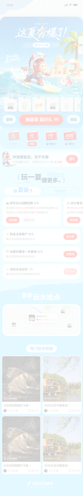
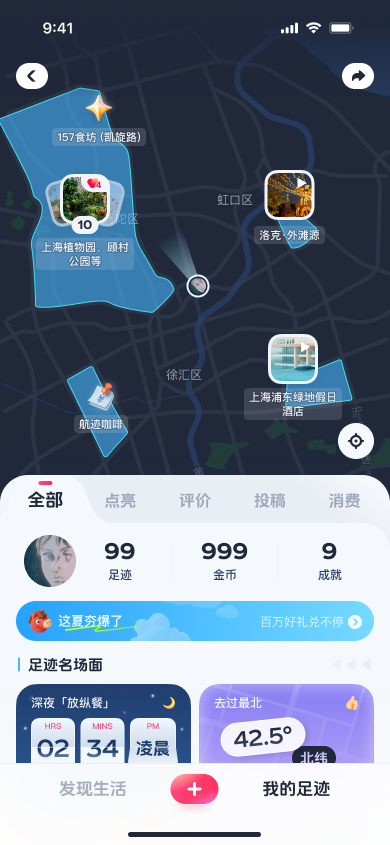
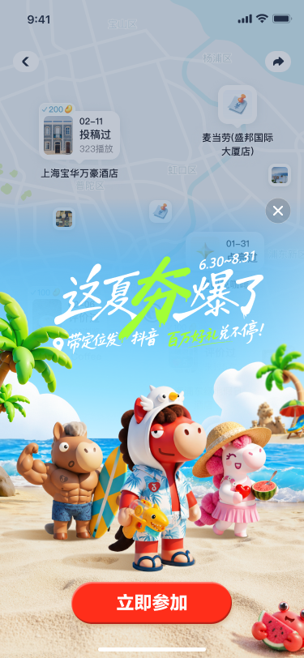
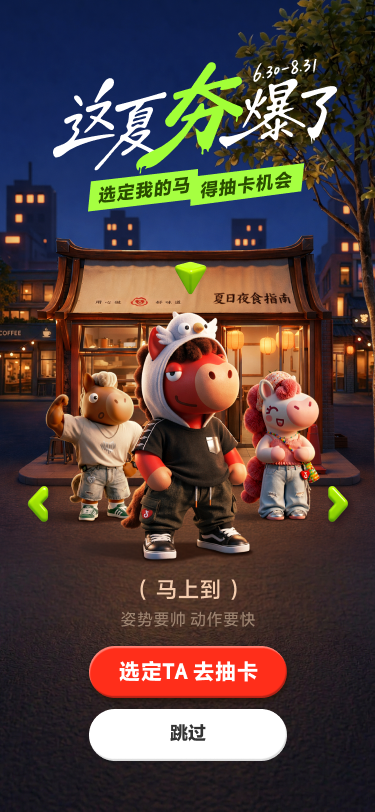
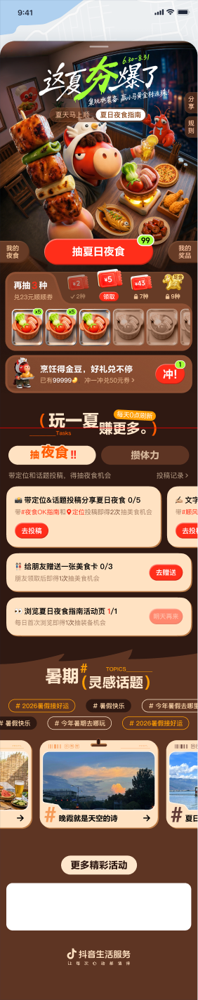
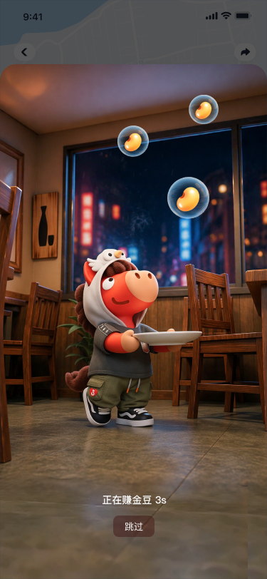
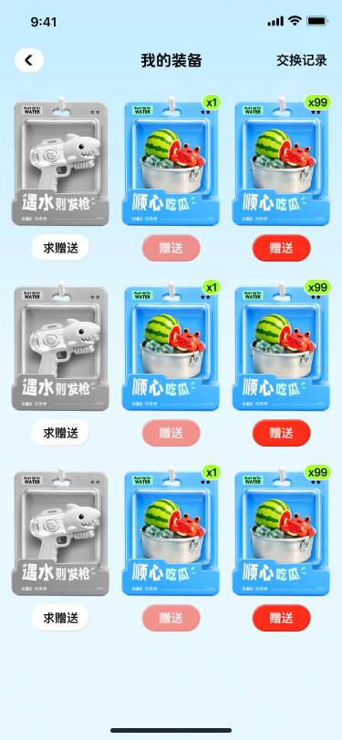
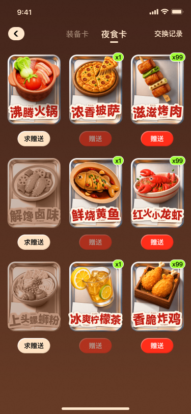

# 生活服务 UGC「抓马」Brand Kit · 2026 H1

## 1. 先给结论

这份 Figma 不是《这夏夯爆了》单项目稿。它以 `cover / 春节交互 / 春节UI / 五一交互 / 五一UI / 暑期交互 / 暑期UI - 玩水 / 暑期UI - 美食 / 选马` 组织 2026 H1 的多阶段 UGC 活动，红色小马与“马”字语义贯穿多个节点。

因此，本资产应被定义为：

> 抖音生活服务 UGC 活动的跨节期身份与角色使用规则，而不是一张暑期 KV、一个活动模板，或一套夜食视觉风格。

同时必须保留一个证据结论：现有文件没有提供一枚可独立使用的“抓马”正式字标，也没有证明“抓马”是官方对外品牌名。本包暂按用户命名组织资产；在命名和源文件归档前，任何页面都不能把“抓马”三个字当作 Logo 绘制或发布。

## 2. Brand Kit 管什么

Brand Kit 回答六个问题：

1. 谁在发声：抖音生活服务是业务署名；
2. 谁负责连续识别：红色小马及其稳定结构；
3. 每期如何独立：春节、五一、暑期各有活动标题、档期、场景和利益点；
4. 语言怎样延续：使用自然的“马”字语义和角色口吻，而不是重复贴 Logo；
5. 跨 Surface 保持什么：业务署名、角色识别和阶段活动标题的上下级关系；
6. 哪些东西必须拆走：角色模型与动作进 IP Kit，具体页面和玩法进各自资产层。

## 3. 边界与依赖

| 内容 | 正确归属 | Brand Kit 中的处理 |
| --- | --- | --- |
| 抖音生活服务 Logo、字标、口号与黑白变体 | Brand Kit | 包含使用关系；源件待归档 |
| 红色小马的最低识别结构 | Brand Kit ↔ IP Kit 接口 | 只记录不可变识别锚点 |
| 小马三视图、比例、表情、动作、服装、道具、3D 模型 | 独立 IP Kit | 不收纳，仅引用版本 |
| “马”字双关、角色名和语气边界 | Brand Kit 内容语气 | 包含原则；正式词库待归档 |
| 春节、五一、暑期的活动标题和档期 | 阶段活动身份 | 作为可配置应用层 |
| “这夏夯爆了”标题、玩水蓝、夜食棕、荧光绿 | 暑期 Style / 项目素材 | 不升级为永久品牌资产 |
| 任务、抽卡、集卡、交换、兑奖 | 玩法库 / 页面组件 | 不属于 Brand Kit |
| H5、Native 页面、弹窗、卡册 | 页面 / 页面组件 | 只作为规则证据 |
| 食物、装备、地点、合作角色和 UGC 内容 | 项目素材 / IP 授权 | 不属于 Brand Kit |

## 4. 来源与证据状态

- Figma：`UGC活动-2026H1`
- File key：`kMedatdeXqtzmq0KOeG0qk`
- 用户提供的是文件根链接，没有指定根节点。
- 页面范围：`cover` 加 8 个交互/UI 工作页，另有结构分隔页。
- 已核验的正式暑期节点：14 个，覆盖 H5 长页、原生入口、角色选择、引导、收集、交换、内容列表和 AR 会场。
- 春节 UI 可见连续命名：`马杀鸡 / 吃什马 / fun马过来 / 好运加马 / 杀马特 / 一字马 / 收款马 / 马卡龙 / 马上到`。
- `Page divider`、交互推演白板、未导出的探索稿只用于结构回溯，不进入视觉 Golden Reference。

来源地址：[打开 Figma 源文件](https://www.figma.com/design/kMedatdeXqtzmq0KOeG0qk/UGC%E6%B4%BB%E5%8A%A8-2026H1?m=dev)

## 5. 身份架构

### 5.1 OWNER：抖音生活服务业务署名

- 角色：明确活动所属业务与站内承接主体。
- 组成：抖音图形标 + `抖音生活服务`字标；部分场景带业务口号。
- 固定：Logo 原形、字标内容、基线关系、高对比安全区。
- 可变：黑色/反白来源版本、位置、是否带口号。
- 禁止：AI 重绘、拆字、加描边、改变字距、与活动标题拼成新 Logo。

### 5.2 IP：抓马角色识别

- 角色：在不同节期、场景与服装中提供连续识别。
- 当前可确认的识别锚点：红色主体、深棕鬃尾、米色口鼻和手脚、半睁眼神态、圆润玩具体块。
- 固定：头身比例、鼻口体块、鬃尾结构、基础配色、眼神气质。
- 可变：动作、服装、道具、场景光线、同场角色。
- 资产边界：可变项必须从关联 IP Kit 选择，不由 Brand Kit 临时生成。

### 5.3 CAMPAIGN：阶段活动身份

- 角色：让春节、五一、暑期分别拥有清晰的活动主张。
- 组成：阶段标题字 + 档期 + 一句利益点 + 抓马角色 + 业务署名。
- 固定：活动标题、角色和业务署名保持三层，不互相冒充。
- 可变：节点名称、标题字、横竖版、档期、场景、玩法和合作内容。
- 示例：`这夏夯爆了`只属于暑期活动身份，不是抓马母品牌名。

## 6. 色彩系统

### 6.1 核心身份色

| Token | 色值 | 角色 | 状态 |
| --- | --- | --- | --- |
| Identity Ink | `#161823` | 抖音生活服务标识、正文与高对比信息 | 已核验 |
| Reverse White | `#FFFFFF` | 深色场景反白署名、信息面和安全留白 | 已核验 |
| Horse Red | `#FF4A32` | 小马主体、主动作与关键状态的连续识别色 | 工作采样；标准值待 IP 源件确认 |
| Mane Brown | `#3A1814` | 小马鬃尾与角色暗部 | 工作采样；标准值待 IP 源件确认 |

核心色的使用边界：

- Identity Ink 和 Reverse White 服务业务署名与信息可读性；
- Horse Red 和 Mane Brown 服务角色识别，不能改色抖音生活服务 Logo；
- 角色在不同灯光下可产生明暗变化，但不能变成另一套基础配色。

### 6.2 暑期活动应用色

| Token | 色值 | 角色 | 边界 |
| --- | --- | --- | --- |
| Water Sky | `#55CDF3` | 玩水线背景、清凉空间和水面高光 | 仅暑期玩水应用 |
| Night Brown | `#5B2F20` | 夜食线木质夜景、容器和正文 | 仅暑期夜食应用 |
| Acid Green | `#9AFF22` | 标题重点字、选择箭头和机会提示 | 仅小面积强调 |
| Warm Cream | `#FFF4DE` | 任务卡、夜食信息面和暖色承接 | 需配深棕正文 |
| Action Red | `#FF3F2D` | 抽取、选择、领取和去完成 | 状态色，不是新 Logo 色 |

这些颜色只证明《这夏夯爆了》的暑期应用方式。春节、五一必须从各自正式节点提炼独立应用色，不得直接继承整组暑期色。

## 7. 字体与内容角色

### 7.1 阶段活动标题字

- 暑期 `这夏夯爆了`：白色手写主字，荧光绿重点字，带飞白/喷绘感；标题与档期组成受控锁定。
- 用途：活动 Hero、角色选择页、资源位、分享卡。
- 禁止：用普通字体重打、AI 仿画、改变重点字，或从位图估算出不存在的字体名称。
- 状态：暑期位图已核验；春节、五一标题源和可编辑矢量待归档。

### 7.2 “马”字语义标题

- 语气：短促、口语化、轻松、带一点角色反差；双关必须自然可读。
- 已有证据：马杀鸡、吃什马、fun马过来、好运加马、杀马特、一字马、收款马、马卡龙、马上到。
- 用途：角色名、轻量标签、活动入口、阶段玩法命名。
- 禁止：为押“马”牺牲理解、制造敏感谐音，或把语气词当正式品牌 Logo。

### 7.3 Hero 利益点 / 副标题

- 形式：一句可执行收益，字重高但低于活动标题。
- 示例：`选定我的马 得抽卡机会`。
- 档期、利益点、玩法说明分层，不能全部做成同样大的艺术字。

### 7.4 UI 标题 / 主按钮

- 高字重中文无衬线；短句、单行动作优先。
- 主按钮：红色实底、白字、大圆角。
- 次动作：白底或描边，不与主动作同权重。
- 禁用态：降低对比和阴影，不另造新的品牌色。

### 7.5 正文 / 数据

- 常规中文无衬线；日期、次数、进度、奖励数值和单位分级。
- 长规则、任务说明和地点信息不得使用活动标题字。
- `font-family`、字重、端侧替代和字体授权均待 Figma 字体清单归档。

## 8. 组件规则

### 8.1 生活服务业务署名

- Anatomy：抖音图形标 / 抖音生活服务字标 / 业务口号（可选）。
- Fixed：Logo 原形、字标、基线、高对比安全区。
- Configurable：黑色/反白版本、位置、是否带口号。
- Evidence：玩水长页、夜食长页页脚与原生入口。

### 8.2 抓马识别锚点

- Anatomy：红色主体 / 深棕鬃尾 / 米色口鼻与手脚 / 半睁眼神态 / 当前服装或道具。
- Fixed：角色比例、核心体块、基础配色、眼神气质。
- Configurable：动作、服装、道具、场景与同场角色。
- Evidence：cover、春节 UI、暑期主会场与选择马页面。

### 8.3 阶段活动签名

- Anatomy：阶段活动标题字 / 档期 / 一句利益点 / 抓马角色 / 业务署名。
- Fixed：三层身份关系、标题和角色安全区。
- Configurable：春节/五一/暑期标题、横竖版、场景和利益点。
- Evidence：春节 UI、五一 UI、暑期玩水与夜食页面。

### 8.4 角色选择 Hero

- Anatomy：阶段活动签名 / 角色全身像 / 角色名 / 姿势提示 / 主按钮 / 跳过动作。
- Fixed：角色全身像优先、主动作唯一、角色名与当前形象匹配。
- Configurable：角色款式、左右切换、机会文案、背景场景。
- Evidence：`暑期UI - 美食`，node `9683:26518`。

### 8.5 马字语义标签

- Anatomy：短语前后缀 / “马”字双关 / 图标或表情（可选）。
- Fixed：含义自然、业务可读、上线前过内容安全校验。
- Configurable：活动主题、玩法动作、角色名和语气强弱。
- Evidence：春节 UI 的九组连续图层命名。

### 8.6 阶段色适配器

- Anatomy：核心身份色 / 阶段背景色 / 一个强调色 / 信息面 / 状态色。
- Fixed：角色识别色、业务署名对比和主动作可访问性。
- Configurable：玩水蓝、夜食棕、节期配色、背景材质和装饰密度。
- Evidence：玩水与夜食正式长页；春节、五一 UI 分支。

## 9. 暑期正式证据图片组

图片用于证明 Brand Kit 如何落在真实 Surface，不等于可以直接外发的 Logo 或 IP 源文件。

### 9.1 玩水活动签名与 Hero

- Page：`暑期UI - 玩水`
- Node：`7880:28626`
- 源尺寸：`390×2320`
- 证明：阶段标题、档期、角色、抽取动作、任务与业务署名的完整层级。

### 9.2 原生活动入口

- Page：`暑期UI - 玩水`
- Node：`8214:64702`
- 源尺寸：`390×845`
- 证明：活动在 Native 首页以轻量入口呈现，不复制 H5 长页。

### 9.3 新手引导

- Page：`暑期UI - 玩水`
- Node：`8877:70573`
- 源尺寸：`375×812`
- 证明：角色、步骤说明和唯一主动作的层级。

### 9.4 角色选择 Hero

- Page：`暑期UI - 美食`
- Node：`9683:26518`
- 源尺寸：`375×812`
- 证明：阶段标题、角色全身像、角色名、姿势提示、主动作与跳过动作。

### 9.5 夜食线活动签名

- Page：`暑期UI - 美食`
- Node：`9553:15006`
- 源尺寸：`375×1898`；本地导出 `282×1424`。
- 证明：同一角色识别进入夜食棕语境，阶段色不改变业务署名和角色结构。

### 9.6 角色与夜食场景适配

- Page：`暑期UI - 美食`
- Node：`9697:3607`
- 源尺寸：`375×812`
- 证明：角色互动、沉浸场景和活动入口的组合方式。

### 9.7 玩水线收集状态

- Page：`暑期UI - 玩水`
- Node：`8091:73128`
- 源尺寸：`375×812`
- 证明：阶段应用色可延展到收集和赠送状态，但卡面结构属于玩法视觉。

### 9.8 夜食线收集状态

- Page：`暑期UI - 美食`
- Node：`9834:33984`
- 源尺寸：`375×812`
- 证明：玩法骨架跨主题复用，夜食卡面和奖励不进入品牌基础件。

## 10. 生成与发布检查

必须：

- 先选活动节点，再选活动标题、场景、利益点和玩法；
- 角色从独立 IP 资产引用，不从一句 Prompt 重新画一匹相似的马；
- 保留红色主体、深棕鬃尾、米色口鼻/手脚和眼神气质；
- 业务署名与活动标题分层，Logo 使用来源提供的黑色或反白版本；
- 色值标注“核心身份色”或“阶段应用色”；
- 外发成品记录 Figma page、node ID、源尺寸、Brand Kit 和 IP Kit 版本。

禁止：

- 把“抓马”三个字当作已存在的正式 Logo；
- 把 `这夏夯爆了`改成母品牌名；
- 把暑期标题、场景、卡面、食物、装备和玩法写入品牌永久层；
- 在 Brand Kit 内收纳或生成小马全部动作、服装和 3D 模型；
- 为押“马”制造难懂或敏感谐音；
- 把交互白板、试稿、外部参考或项目生成图放进视觉 Golden Reference。

## 11. 待归档，不得伪装成已齐备

1. “抓马”是否为官方资产名，以及命名、权属和业务使用范围；
2. 小马独立 IP Kit：标准三视图、结构比例、表情、动作、服装、3D 模型和授权；
3. 抖音生活服务 Logo/口号的 SVG、透明 PNG、黑白变体、安全区和最小尺寸；
4. 春节、五一正式视觉的独立导出和节点清单；
5. 阶段标题字矢量源、正式字体清单、端侧替代和字体授权；
6. “马”字语气词库、禁用词和内容审核负责人。

这些内容补齐前，本包可以用于资产架构审阅与暑期项目引用追溯，但版本保持 `0.9.0 / 待更新`，不能标记为已发布。
