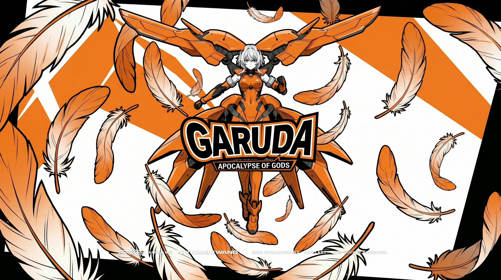
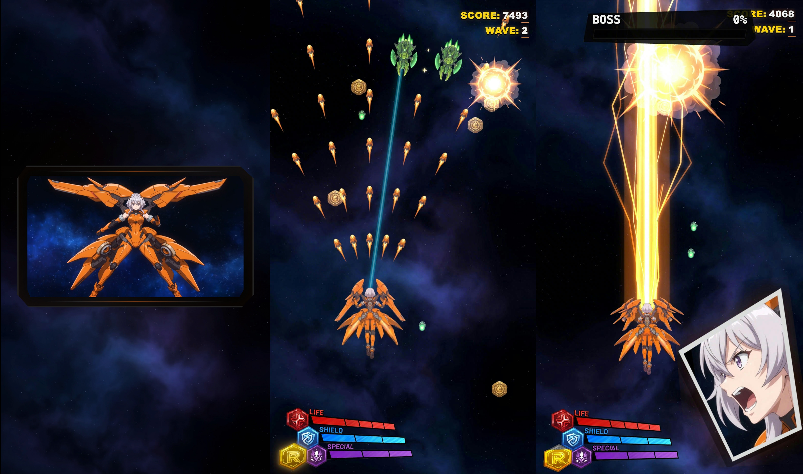
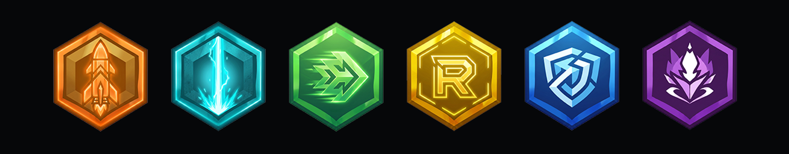

# Garuda: Apocalypse of Gods



[Play Garuda online](https://awplanets.github.io/garuda/)

**Garuda** is a STG + Roguelike vertical space shooter built with AI throughout
the full production pipeline. The development layer was constructed through a
Vibecoding workflow: core code and gameplay logic were completed in
collaboration with OpenAI Codex, while the visual direction combines NanoBanana
and Seedance 2 for art element creation and frame animation design. Codex was
then used for batch processing of art assets, keeping the final style
controllable, iterative, and highly unified. LibTV was used as the preferred
AI art platform; its stable model resources and compute support made it
possible to carry this project through a consistent production workflow.

Compared with typical clean-screen arcade shooters, **Garuda** targets a higher
60 fps frame rate, smoother high-speed pressure, sharper dodge feedback, denser
tactical structure inside bullet-heavy combat, and a more fluid Roguelike
growth curve.



## Roguelike Builds



More than six random talent paths can create different shooting styles:

- **Bullet Storm Assault**: ultra-high fire rate and coverage-based firepower
  suppress enemies, forming a near-storm of bullets across the screen.
- **Laser Ricochet**: refraction and chaining allow the laser to keep jumping
  between enemy groups for continuous field clearing.
- **Endless Shield**: shield recovery, energy loops, and counter-damage help
  the player stay nearly unkillable inside dense bullet pressure.
- **Particle AOE**: special weapons provide sustained full-field area damage,
  creating chained destruction across large enemy clusters.

Escalating enemy difficulty and randomized enemy traits keep each run tense and
challenging from wave to wave.

## Controls

- Arrow keys, WASD, or IJKL to move.
- Space, X, C, Z, Y, or 0 to fire.
- Q to activate shield.
- E to release bomb.
- R to trigger Killer when charged.
- P or Esc to pause.
- F to toggle fullscreen.


## Resolution Guide

Garuda includes multiple render-resolution presets. For the smoothest
experience, choose a resolution based on your GPU class and available graphics
memory. If the game feels choppy during dense waves, lower the render
resolution first before reducing browser zoom or disabling fullscreen.


## Local Development

```bash
npm run dev
```

```bash
npm run build
```

```bash
npm run web:release
```

The static web release is written to `../garuda_web_release`. It keeps the same
visual result while excluding desktop-only build output and unused source
videos. Online builds register a Service Worker so repeat visits reuse cached
assets.

## License

Source code is licensed under the [MIT License](LICENSE).

All visual, audio, video, animation, character, logo, UI, branding, and Garuda
IP assets are proprietary and registered for copyright protection. They are not
covered by the MIT License and may not be reused without explicit written
permission. See [ASSET_LICENSE.md](ASSET_LICENSE.md).

## Acknowledgements

Special thanks to [LibTV](https://www.liblib.tv/) for compute support and
production help throughout the project.
